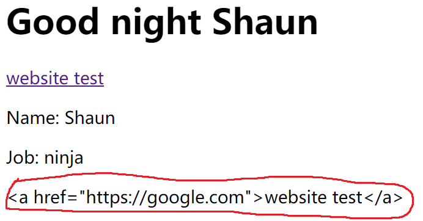

# vue.js理解

## 1. vue.js的引用

vue.js可以直接通过script标签进行引用，如：

```html
<script src="https://unpkg.com/vue"></script>
```

当引用了vue.js后，便可以在html中进行vue app的实例化操作

通常的做法是创建一个app.js文件，并在页面加载完成后进行引用。引用位置如bode标签的底部或者是footer中

## 2. app.js

在app.js文件中，通常是创建一个vue的实例对象：

```js
new Vue({
    el: '#vue-app',
    data: {
        name: 'Shaun',
        job: 'ninja',
        website:'https://google.com'
    },
    methods:{
        greet: function( time ){
            return "Good " + time + ' ' + this.name
        }
    }
});
```

其中，

- el 字段代表了vue.app作用的区块

- data 字段代表了Vue实例的成员变量
- method 字段代表了Vue实例的成员函数

## 3. 在html中对成员变量的引用

在html中，可以直接在vue.app作用区块中对vue的成员变量或成员函数进行引用

```html
<div id="vue-app">
        <h1>{{greet('night')}} </h1>
        <p>Name: {{name}}</p>
        <p>Job: {{job}} </p>
    </div>
```

## 4. 在属性中的引用（v-bind）

若要在dom的属性中对vue的成员变量进行引用，直接输入{{ name }}是不可以的

因此需要使用vue的v-bind方法

```html
<a v-bind:href="website">website test</a>
```

此方法可以简写为一个冒号

```html
<a :href="website">website test</a>
```

## 5. 在dom中插入html语句

若在vue的实例对象的成员中，存在有html语句如：

```js
websiteTag:'<a href="https://google.com">website test</a>'
```

在html中直接用花括号引用会使此语句变成一个字符串：

```htm
{{websiteTag}}
```

输出结果如下：



这样页面便无法渲染html的语句

因此，可以使用与v-bind类似的v-html方法，在属性中引用

```html
<p v-html="websiteTag"></p>
```

**注意： v-html会替换掉标签内的所有内容！**

## 6. 添加Event事件

### 6.1 基本的@（v-on）方法

在html中，经常会有onclick事件调用js函数

在vue中，可以使用v-on将onclick事件绑定到vue的成员函数中

```html
<h1>Events</h1>
<button v-on:click="add()">Add a Year</button>
<button v-on:click="subtrack()">Subtrack a Year</button>
<p>My age is {{ age }} </p>
```

其中，v-on:click就对应了js的onclick事件，当点击对应的按钮时，会触发vue实例中的相关函数

```js
methods:{
    add: function(){
        this.age++
    },
    subtrack: function(){
        this.age--
    }
}
```

并且，函数也可以传递对应参数

```html
<h1>Events</h1>
<button v-on:click="add(1)">Add a Year</button>
<button v-on:click="subtrack(1)">Subtrack a Year</button>

<button v-on:dblclick="add(10)">Add 10 Year</button>
<button v-on:dblclick="subtrack(10)">Subtrack 10 Year</button>
<p>My age is {{ age }} </p>
```

app.js.methods

```js
methods:{
    add: function(inc){
        this.age+=inc
    },
    subtrack: function(dec){
        this.age-=dec
    }
}
```

在v-on方法的调用中，若函数不需要额外的参数，那么函数后的括号可以不添加

这时，如果调用的方法本身就有一个参数，如mousemove，那么这个参数就会通过event参数传递

```html
<div id="canvas" v-on:mousemove="updateXY($event)">
    {{x}},{{y}}
</div>
```

这种使用默认参数的方法也简写成：

```html
<div id="canvas" v-on:mousemove="updateXY">
	{{x}},{{y}}
</div>
```

这时，对应的方法应为

```js
updateXY: function(event){
    // console.log(event)
    this.x = event.offsetX
    this.y = event.offsetY
}
```

若要传递参数，则可以在括号中直接添加

```html
<div id="canvas" v-on:mousemove="updateXY(100,$event)">
    {{x}},{{y}}
</div>
```

此时，对应函数变为：

```js
updateXY: function(inc,event){
    // console.log(event)
    this.x = event.offsetX+inc
    this.y = event.offsetY+inc
}
```

此外，v-on:可以简写为@：

```html
<button @click="add(1)">Add a Year</button>
```

### 6.2 （once）一次执行

当在监听事件后面添加once属性时，此监听事件便只执行一次

```html
<button @click.once="add(1)">Add a Year</button>
<button v-on:click.once="subtrack(1)">Subtrack a Year</button>
```

### 6.3 (prevent) 阻止原事件执行

```html
<a @click.prevent="click" href="https://google.com">click me</a>
```

当添加prevent属性后，vue会阻止原来的link链接跳转事件，从而改为执行click函数

## 7. 键盘事件